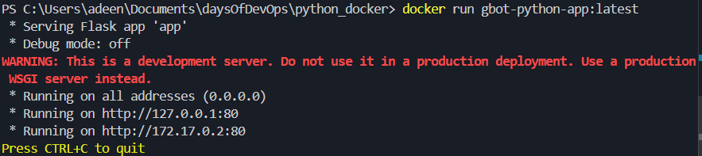
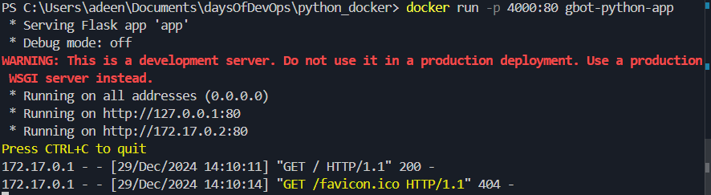
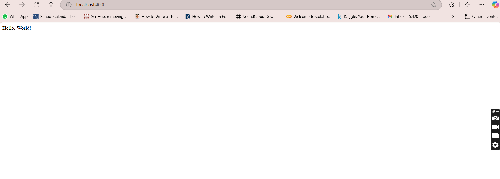

## Create the app.py, requirements.txt and dockerfile with their contents
- Run "docker build -t gbot-python-app:tag" to build the image
or NB. the tag can be "latest"
- Run "docker pull python:3.9-slim"
- docker run gbot-python-app:latest

the running container

i stopped the container and gave it a port on my local machne

- Run the docker container with "docker run -p 4000:80 gbot-python-app", to map port 80 in the container where Flask is running to 4000 on my local machine, therefore, I should be able to access my app in my browser at http://localhost:4000 displaying "Hello World"

the running 4000 on my local

THE APP RUNNING ON MY LOCAL DEVICE

- docker ps  # List running containers
- docker stop <container_id>  # Stop the container by its ID

- To push to docker hub, the tag must be changed to your username
- Run "docker tag gbot-python-app gbotman/gbot-python-app:latest"

# PUSH THE IMAGE
- docker push gbotman/gbot-python-app:latest
- docker push gbot-python-app #it will not work as there is no username associated with it

